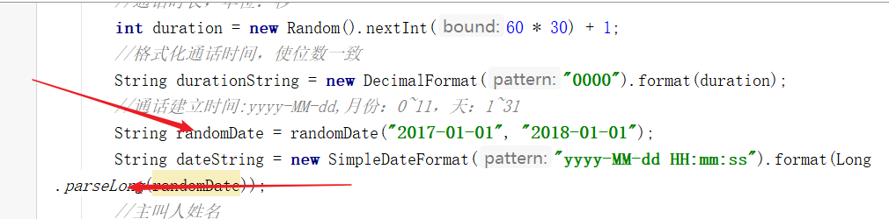
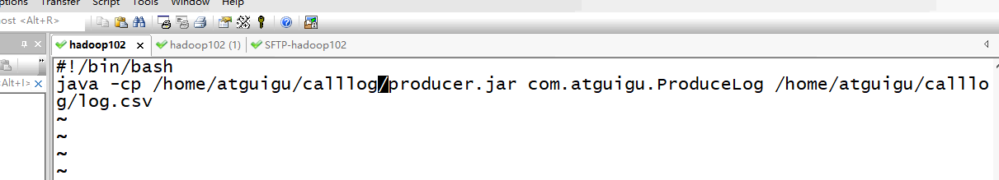

# 7.13笔记-电信客服项目

能不在这里写就不在这里写，写到文档中去

hbase高级 给hbase 建立二级索引  可能会用到协处理器

本项目用MR来分析数据   谷粒影音用的是hive   ，完事之后 用hive 的分析手段实现一下  

6个指标？

分析阶段  可以自己加上sqoop 导入mysql   ； 用oozie  控制工作流

生成通话建立时间  变成String  

老师给（3）的random 前面都加上了new ？

老师把拼接姓名的都删掉了

在linux 上  执行普通的jar 包 命令   【 Java  -cp  jar包名  参数  】

写个脚本

3.2 采集  

exec ——memorychanal——kafkasink

3.2.1 （4 ）source 中 需要改路径

10：35  换名字解决

ClassLoader 用类加载器加载静态资源   路径是classpath

HBaseUtil 

下午

roukey  30-100位

【不要用kafka sink  先用控制台的试一下】

第二天  

dao 具体保存数据  重点在于保存   

查询数据 有两种方式  1. startkey  stopkey   2.过滤器  

协处理器：

truncate 清空hbase 的表  会把分区键也删掉    最好重新建表

14：36  修改表结构

hbase建立二级索引——用协处理器   用另外一张表存储索引，查询的时候先查询索引表，两个表的结构不一样

协处理要单独打包 放到lib下面 配置文件

配置上

#7.14

整月或者整年的查询要求【有则更新，无则插入】，就 要求sql需要有主键 ，  但是自增长的主键的值不好确定，需要提前知道，这样才能不断更新整月整年的数据。

维度类（javabean）放在key的位置 要实现WriteableCompreable   不想实现方法就用abstract
创建两个维度表对应的类  都继承BaseDimension

7.17    

今天新写的类有
convertor文件夹
outputformat文件夹
Utils文件夹
三个文件夹中的所有内容

sql语句   反引号的作用是为了不让sql识别为某些系统字符，API操作写sql千万不要在表名的前面加上数据库的名称。

hbase——资——构建ppt    

